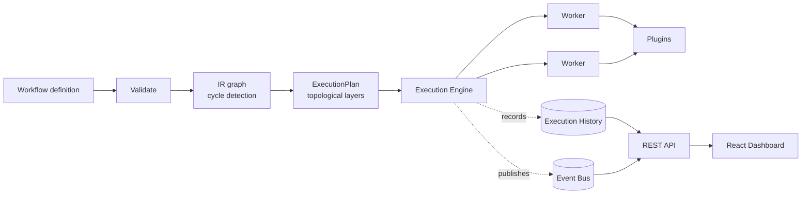

# FlowForge

An explainable, AI-ready, event-driven workflow orchestration platform, built from scratch in Python and TypeScript.

[](https://github.com/eshitarai27/workflow-engine/actions/workflows/ci.yml)
[](LICENSE)
[](requirements.txt)

## About this project

FlowForge started as a small assignment: a graph engine with a handful of nodes and a single example workflow. I rebuilt it into something closer to what a real workflow orchestration platform, in the spirit of Temporal, Prefect, Airflow, or n8n, actually needs: a proper compiler and planner, a DAG execution engine with real concurrency, retries, and checkpointing, a plugin system instead of hardcoded actions, and a dashboard to actually see what a run did and why.

The goal throughout was to keep it small enough to read end to end while still being honest about the hard parts. Nothing here is a black box: every node's execution is recorded with why it ran, why it waited, its timing, and its inputs and outputs, and the whole system is covered by 62 tests that exercise real concurrency, real retries, and a real SQL write, not mocks standing in for behavior I didn't implement.

There is no AI required anywhere in the platform. One optional feature turns a natural-language description into a workflow definition using a configured LLM provider; everything else runs with zero external services and zero configuration.

## Live demo

- Dashboard: https://flowforge-dashboard.vercel.app
- API: https://flowforge-backend-production-ad69.up.railway.app

A quick way to see it work: `curl -X POST https://flowforge-backend-production-ad69.up.railway.app/workflows -H "Content-Type: application/json" -d @examples/code_review_loop.json` to create a workflow, then open the dashboard to run it and watch the execution graph.

## What it does

- **A DAG execution engine with real concurrency.** Independent nodes run in parallel on a thread pool, with a retry policy and backoff, a per-node timeout, cooperative pause and cancel, a checkpoint written after every layer, and resume from the last checkpoint.
- **A compiler and planner kept separate from execution**, so a workflow can be validated, and even simulated (execution order, critical path, likely bottlenecks), without ever running anything.
- **Ten plugins** covering the common cases: HTTP, webhook, Python, JavaScript, SQL, filesystem, email, Slack, OpenAI, and Docker, each with its own configuration schema.
- **Config templating**, so a node can reference an earlier node's output with `{{name}}`.
- **Bounded looping on a single node**, so an iterative workflow (like the original assignment's code-review loop) stays expressible without the graph itself needing a cycle.
- **An internal event bus** with a full lifecycle event catalog, feeding structured logs and a live event stream in the dashboard.
- **SQLite-backed storage** with full workflow version history and the ability to diff two versions.
- **A scheduler** for interval-based triggers and webhook-triggered runs.
- **A REST API** covering all of the above.
- **Optional AI-assisted workflow generation** across four providers (OpenAI, Anthropic, Google, Ollama), which degrades to a clear error rather than a crash when none are configured.
- **A React dashboard**: an interactive workflow builder, a live execution graph with a node inspector, a simulation view, metrics, and a plugin manager.

## Architecture



See [`docs/architecture.md`](docs/architecture.md) for the full pipeline, a sequence diagram of one execution, an explanation of why loops don't need graph cycles, and the safety reasoning behind the Python plugin and the condition evaluator.

## Running it locally

### Backend

```bash
pip install -r requirements-dev.txt   # only needed to run tests
python main.py                        # listens on http://0.0.0.0:8000
```

```bash
curl -X POST http://localhost:8000/workflows -H "Content-Type: application/json" -d @examples/code_review_loop.json
```

Configuration is entirely optional and read from environment variables in `src/config/settings.py`. See `.env.example` for the full list, including the AI provider keys.

### Frontend

```bash
cd frontend
cp .env.example .env
npm install
npm run dev   # listens on http://localhost:5174
```

## Docker

```bash
docker compose up --build
```

Backend on `http://localhost:8000`, frontend on `http://localhost:3000`. SQLite data persists in a named volume.

## Deployment

The live demo above runs on:

- The backend on Railway, deployed with `railway up` from the repo root. A `Procfile` (`web: python main.py`) tells it how to start, and `config/settings.py` reads whichever port Railway assigns automatically.
- The frontend on Vercel, project `eshita-rai/flowforge`, deployed with `vercel --prod`, with `VITE_API_BASE_URL` set as a project environment variable pointing at the Railway backend.

Both are manual CLI deploys rather than push-to-deploy. Connecting each project to this GitHub repo through its dashboard would make every push to `main` redeploy automatically, which is a reasonable next step if this were going into ongoing use.

## Example workflows

Three ready-to-run definitions live in [`examples/`](examples/), and all three were validated and actually executed against a running instance while I was writing them, not just written and assumed to work:

- `summarize_and_notify.json` reads a file, summarizes it, saves the summary to SQLite, and emails it, exercising config templating end to end.
- `code_review_loop.json` is a direct port of this project's original assignment logic (extract, check complexity, detect issues, suggest improvements, loop until a quality threshold) onto the bounded-loop node, which was the cleanest way to prove the new engine could still do what the old one did.
- `etl_pipeline.json` extracts a batch, transforms it two independent ways in parallel, and loads the result. It's a good one to look at in the Simulation view, since it actually has a parallel branch to show.

## API

Full reference: [`docs/api.md`](docs/api.md).

| Method | Path | Purpose |
|---|---|---|
| POST | `/workflows` | Create a workflow |
| GET / PUT / DELETE | `/workflows/{id}` | Read, save a new version, delete |
| POST | `/workflows/{id}/execute` | Start a run |
| GET | `/executions/{id}` | Full execution detail and history |
| POST | `/executions/{id}/pause` \| `/resume` \| `/cancel` | Control a running or paused execution |
| POST | `/workflows/{id}/simulate` | Execution order, critical path, bottlenecks |
| GET | `/plugins` | Every plugin's config schema |
| GET | `/ai/providers`, POST | `/ai/generate` | Optional natural-language workflow generation |
| GET | `/events` | Live platform event stream |

## Testing

```bash
pip install -r requirements-dev.txt
pytest -v
```

62 tests, covering the compiler (validation, cycle detection with the actual cycle reported), the planner (layering, critical path), the full engine (parallel execution, retries, skip propagation, conditions, looping, timeout, cancel, pause and resume), config templating, every plugin's real behavior, the event bus, storage and versioning, the scheduler, and the REST API end to end.

## Project structure

```
workflow-engine/
├── src/
│   ├── models/       domain types: Workflow, Node, Edge, Execution, ...
│   ├── compiler/     validation, IR, cycle detection
│   ├── planner/      topological layering, critical path
│   ├── engine/       DAG execution, checkpoints
│   ├── executor/     single-node retry, timeout, looping
│   ├── workers/      the thread pool nodes run on
│   ├── plugins/      HTTP, Python, SQL, JavaScript, filesystem, email, Slack, OpenAI, Docker, webhook
│   ├── events/       the internal event bus
│   ├── scheduler/    schedule and webhook triggers, execution queue
│   ├── storage/      SQLite repositories, workflow versioning
│   ├── services/     business logic between the API and everything above
│   ├── ai/           optional natural-language workflow generation
│   ├── api/          FastAPI app and routers
│   ├── config/       environment-driven settings
│   └── utils/        safe expression evaluation, templating, ids, logging
├── frontend/         React + TypeScript + Tailwind dashboard
├── examples/         ready-to-run workflow definitions
├── docker/           Dockerfiles and nginx config
├── docs/             architecture and API reference
└── tests/            62 tests across every layer above
```

## A note on scope

This is a solo project built to demonstrate engineering depth, not a production system with a team behind it. It runs as a single process by design, the Python and JavaScript plugins execute real code with no sandbox beyond a restricted builtins list (documented as an explicit trust boundary), and there's no distributed execution across machines. `docs/architecture.md` is upfront about each of these tradeoffs and what a production version would need instead. I'd rather be honest about the boundaries than pretend they don't exist.

## License

[MIT](LICENSE)
