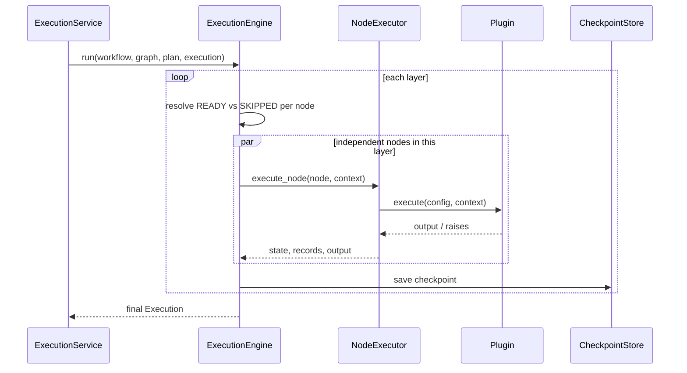

# Architecture

## Pipeline

A workflow moves through four stages before anything runs:

```
raw JSON definition
    ↓ validate_definition
Workflow (dataclasses)
    ↓ IRGraph.from_workflow + cycle detection
IR graph (dependency edges, no cycles)
    ↓ WorkflowPlanner
ExecutionPlan (topological layers)
    ↓ ExecutionEngine
running execution
```

Compilation and planning are pure functions: same definition in, same plan out, nothing executed. That split is what makes simulation possible: `SimulationService` only ever touches the compiler and planner, never the engine.

## Execution



Each node in a layer runs on its own worker thread (`WorkerPool`), so independent branches genuinely run concurrently. A layer only starts once the previous one has fully finished, which the planner guarantees is safe: a node's dependencies always live in an earlier layer.

## Why loops don't need cycles

A DAG can't have cycles by definition, but the original toy version of this project relied on one: a code-review loop that re-ran a chain of steps until a quality score cleared a threshold. Modeling that as literal cyclic edges would break the compiler's guarantee that the graph terminates and can be laid out into layers.

Instead, bounded iteration lives on a single node: `loop: {until_condition, max_iterations}`. The executor re-runs that one node's action, feeding its own output back into the context, until the condition holds or the iteration cap is hit. The graph stays acyclic; the repetition is contained inside one node's execution record, with each iteration logged separately.

## Explainable execution

Every node run produces a `NodeExecutionRecord`: why it ran or was skipped, its dependencies, attempt and retry count, iteration number, worker id, timing, input snapshot, output snapshot, and failure reason if any. `Execution.history` is the full ordered list across the whole run. This is what the frontend's Node Inspector reads directly, no separate logging pipeline required.

## Config templating

A node's `action.config` can reference another node's output with `{{name}}`, resolved against the shared execution context right before the plugin runs (`src/utils/templating.py`). A config value that's *entirely* one placeholder resolves to the referenced value's real type; a placeholder embedded in a longer string gets stringified in place. This is deliberately not a full template language: no loops, no conditionals, just variable substitution.

## Safety choices

- **Condition and loop expressions never reach Python's `eval`.** They're parsed with `ast` and walked by hand (`src/utils/safe_eval.py`), allow-listing comparisons, boolean logic, arithmetic, and variable lookups. Anything else raises before it runs.
- **The Python and JavaScript plugins do run real user code**, the same way Airflow's PythonOperator or n8n's Function node do. That's documented as an explicit trust boundary, not hidden: only use them with trusted workflow definitions.
- **The filesystem plugin is sandboxed** to a configured root directory (`FLOWFORGE_FS_ROOT`), rejecting any path that resolves outside it.

## Concurrency and scaling

FlowForge runs as a single process: one `Container` (see `src/api/deps.py`) owns the plugin registry, worker pool, engine, and every service. The worker pool gives real concurrency for I/O-bound node actions within that process. What it doesn't do is scale execution across multiple machines. A distributed version would need to replace the in-memory `EventBus` and `ExecutionQueue` with something like Redis or a real message broker, and move the SQLite storage layer to Postgres, both of which the repository/service boundaries here were deliberately kept thin enough to allow.

## Timeout semantics

A node's `timeout_seconds` is enforced by running its plugin call in a bounded worker and raising if it doesn't return in time. CPython can't safely force-kill a running thread, so a plugin that ignores its input and blocks forever keeps occupying a background thread after the timeout fires. This is the same limitation nearly every pure-Python task runner has; a harder guarantee would mean running each node in its own subprocess, which is a reasonable next step for plugins that need real isolation.
